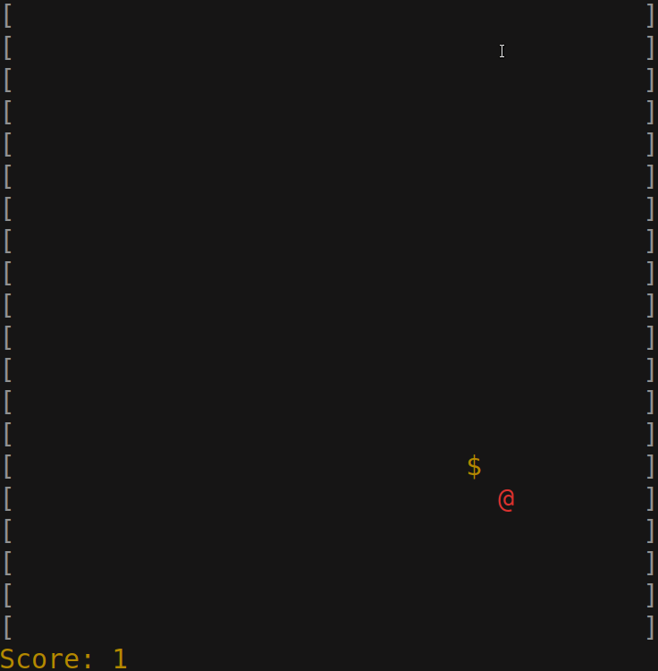

# Snake Game In Go




## Contents
  - [Structure](#structure)
  - [Installation And Running](#installation-and-running)
  - [Controls](#controls)
  - [Configuration](#configuration)

## Structure

- [main.go](./main.go)

  Entry point of the game

- [objects](./objects)

  <strong>board</strong>, <strong>snake</strong>, <strong>food</strong> game objects

- [config](./config)

  Config objects and a toml config parsing function

- [color](./color)

  Helper package for adding color to the terminal

- [routines](./routines)

  Goroutines to capture user input and system calls

## Installation And Running

1) Install the Go language with version found in [go.mod](./go.mod)

2) Clone the repository:

```sh
git clone github.com/Nicolas1st/goSnake
```

3) Download the dependencies:

```sh
go mod download
```

4) Go to the repository directory and run:

```sh
go run main.go
```

## Controls

-  Movement

    <strong>w</strong> - up

    <strong>a</strong> - left

    <strong>s</strong> - down

    <strong>d</strong> - right

-  To quit press <strong>q</strong>
    
## Configuration

1) Edit [config.toml](./config.toml)

2) Set the environment variable to the name of the file above,

   using the following command:

On Linux:

```sh
export gosnake_config_file=config.toml
```

On Windows:

```cmd
set gosnake_config_file=config.toml
```

3) Run the game:

```sh
go run main.go
```
